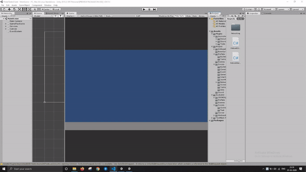
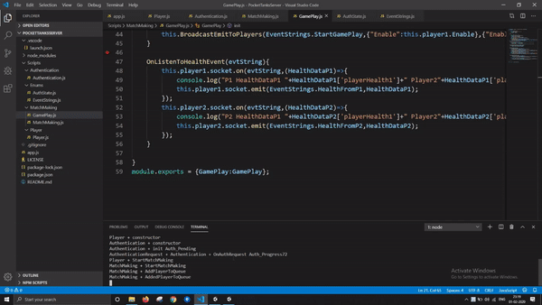

# pocket-tank-client
SUMMARRY -
The Project is based on off the game pocket tanks and tries to recreate the core multiplayer mechanics with a node server at back end as
in different Pocket Tank Server Repository
Patterns Used - MVC,Socket events

1) Authentication from server 

2) MatchMaking & GamePlay

